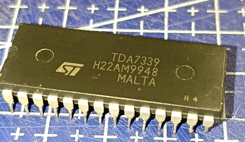
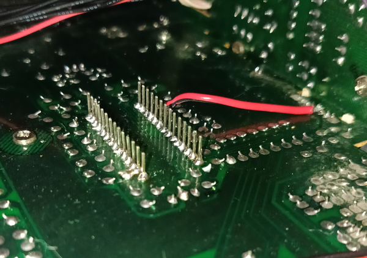
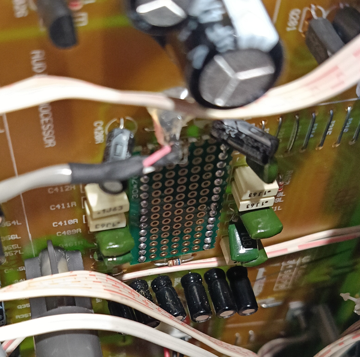
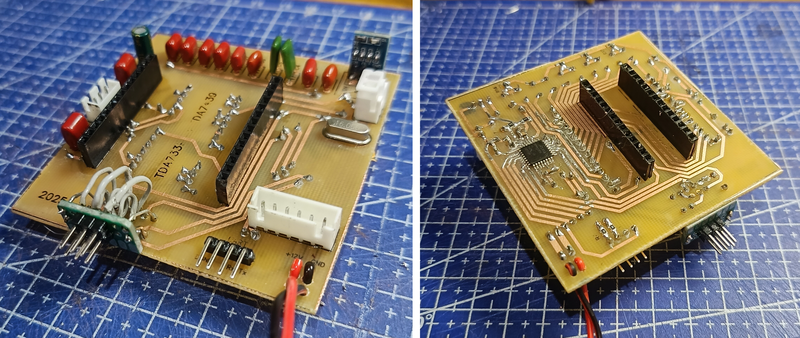
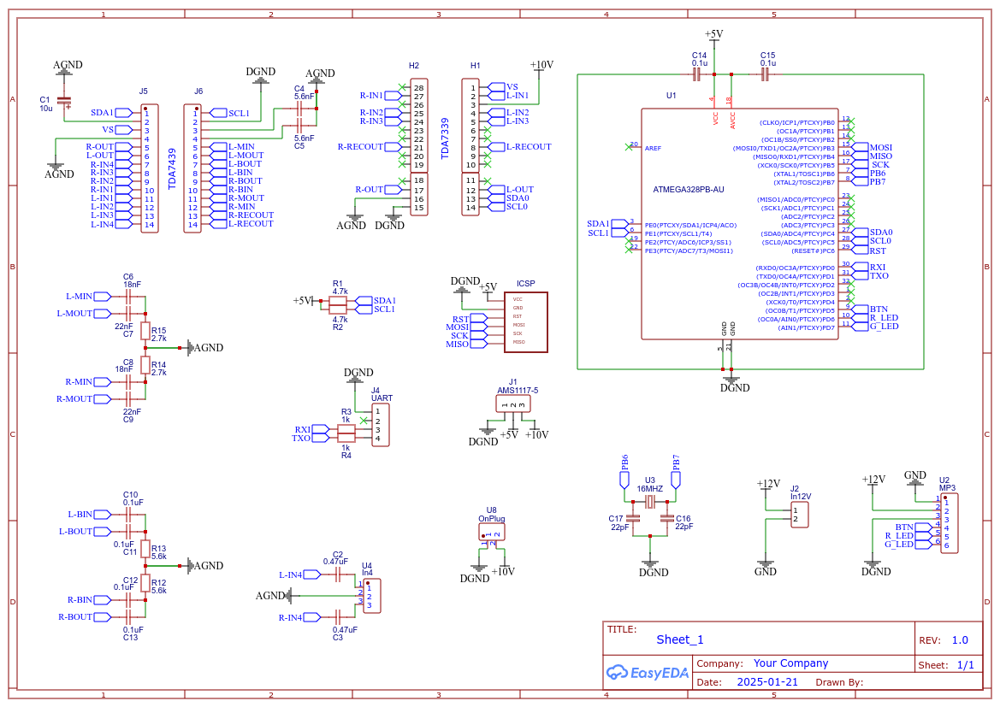
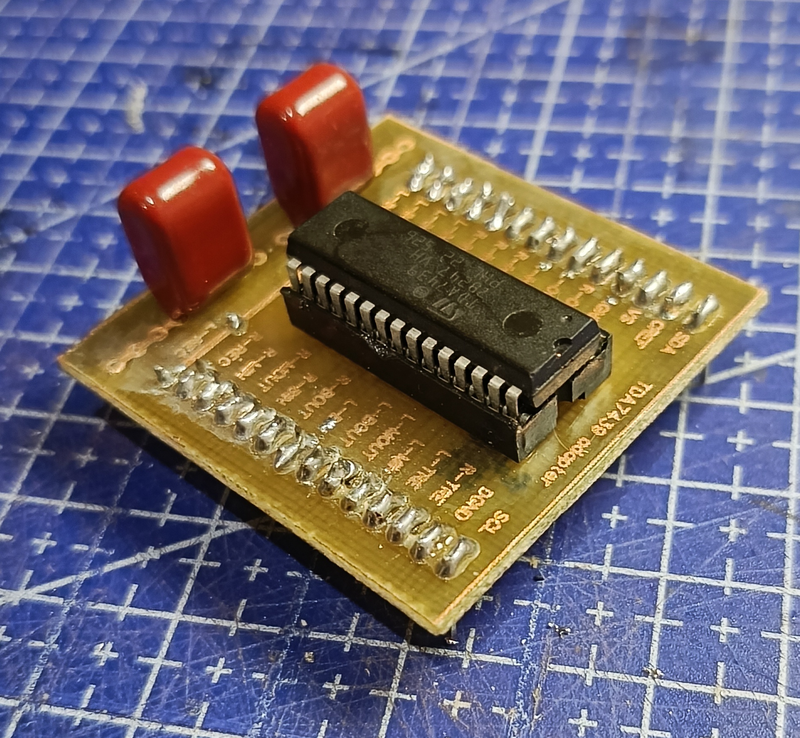
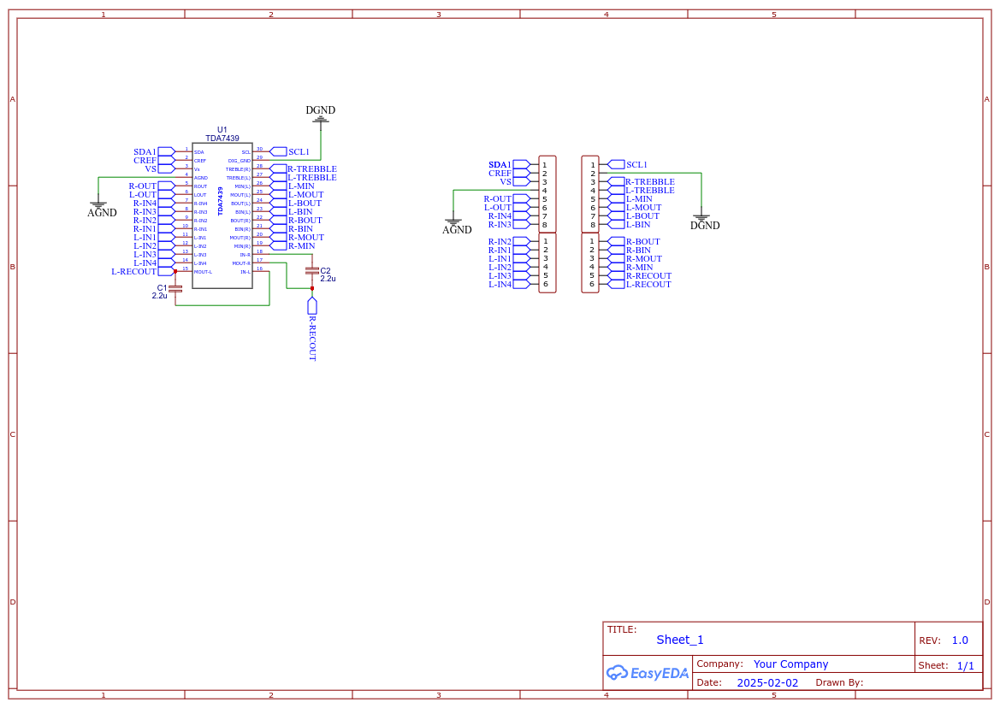
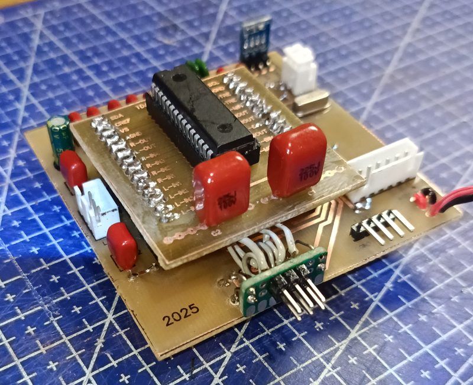
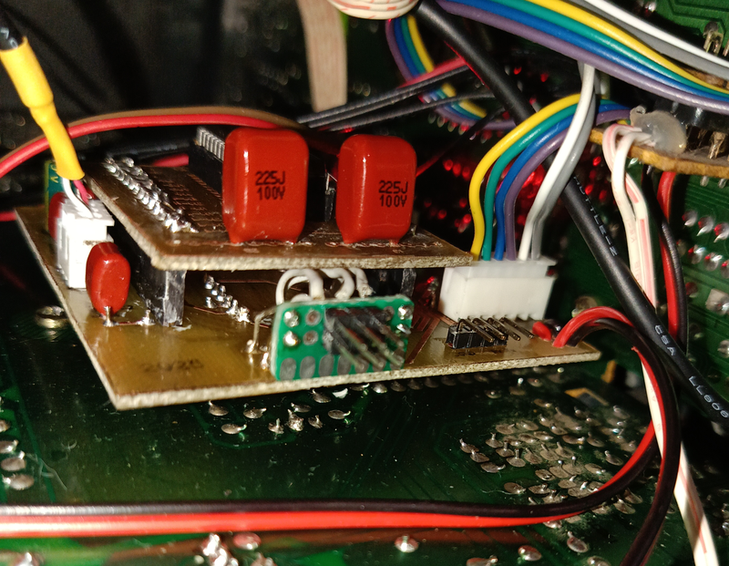
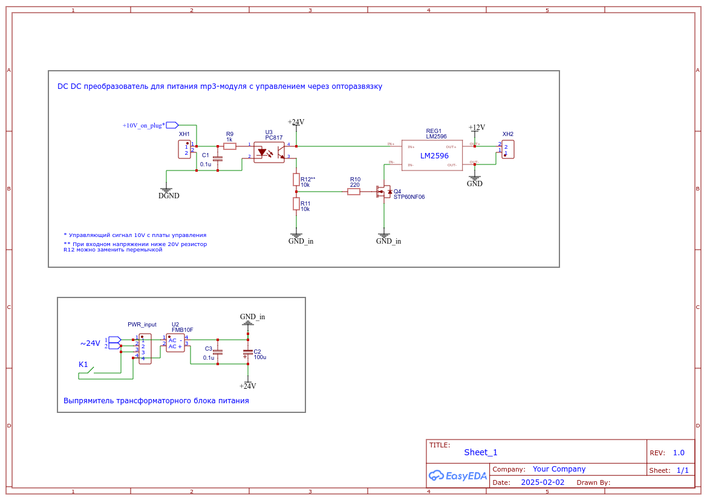

## tda7339_to_tda7439

Модуль, позволяющий использовать микросхему темброблока **tda7439** вместо **tda7339** (которая, как оказалось, практически не существует в природе, найти ее можно разве что в старой технике под утилизацию; у меня найти не получилось). Модуль построен на базе МК **ATmega328pb** в среде Arduino IDE.

- [Краткое описание](#краткое-описание)
  - [Основные характеристики tda7439](#основные-характеристики-tda7439)
  - [Микроконтроллер для управления микросхемой](#микроконтроллер-для-управления-микросхемой)
- [Расшифровка кодов управления](#расшифровка-кодов-управления)
  - [Установка входа](#установка-входа)
  - [Установка громкости](#установка-громкости)
  - [Установка эквалайзера](#установка-эквалайзера)
- [Замена микросхемы на плате](#замена-микросхемы-на-плате)
- [Настройка скетча](#настройка-скетча)
- [Внешний mp3-модуль](#внешний-mp3-модуль)
- [Даташиты](#даташиты)
- [Использованные библиотеки](#использованные-библиотеки)

### Краткое описание

Подопытным оказался музыкальный центр [**Thomson VTCD-800**](docs/VTCD-800_s_m.pdf), полностью исправный (после замены всех пассиков), но с убитым темброблоком. Т.е. все запускается, крутится, считывается, осцилограф показывает сигнал на входах, активность на шине управления, но звука на выходе при этом нет. Оконечный усилитель так же исправен.

В качестве замены была выбрана микросхема **tda7439**, которая имеет схожие параметры, и, что немаловажно, весьма распространена и доступна по цене.

#### Основные характеристики tda7439

- Входной мультиплексор:
  - 4 стерео входа;
  - Настраиваемое усиление входа для оптимальной адаптации к различным источникам звука, от 0 до 30 дБ (с шагом 2 дБ, 0..15);
- Один стерео выход;
- Регулировка тембра НЧ, СЧ, ВЧ, ±14 дБ (с шагом 2 дБ, -7..7);
- Громкость 48 уровней, от -47 до 0 дБ (0..47);
- Независимые аттеньюаторы выходных каналов, от 0 до -79 дБ, например, для регулировки баланса звука;
- Управление и настройка работы микросхемы через шину I2C;

#### Микроконтроллер для управления микросхемой

Т.к. **tda7439** в отличие от **tda7339** имеет другой адрес устройства на шине **I2C** и другую систему команд, для реализации замены понадобится дополнительный микроконтроллер, который будет слушать шину **I2C** музыкального центра, принимать команды от центрального процессора, конвертировать их в нужный формат и отправлять микросхеме **tda7439**.

Требования к микроконтроллеру:
- желательно пятивольтовая логика (как у центрального процессора) - чтобы не заморачиваться согласованием логических уровней;
- наличие двух интерфейсов I2C;

Под эти требования идеально подходит чип **Atmega328pb**.

Для работы с **Atmega328pb** используется аддон [**MiniCore**](https://github.com/MCUdude/MiniCore/tree/master). 

### Расшифровка кодов управления

МК слушает команды центрального процессора на шине **I2C0**, команды на **tda7439** отправляет по шине **I2C1**.

В даташите на **tda7339** расписаны все коды, которыми она управляется. На практике центральный процессор данного музыкального центра отправляет:
- один байт для смены входа;
- два байта для установки громкости (1st Vol и 2nd Vol);
- три байта для установки тембра (bass middle, trebble; используются пять предустановок эквалайзера - rock, jazz и т.д.);

Поэтому управляющий скетч в первую очередь смотрит на размер пакета и исходя из этого принимает решение, какой из параметров будет изменяться. Естественно, полученные данные проходят верификацию на соответствие кодам из даташита.

#### Установка входа

Тут все просто - если три старших бита равны `111`, значит мы приняли номер нового входа. Нужное нам значение определяется вторым и третьим битами:
```
 0b11101110 - 1 вход
 0b11101010 - 2 вход
 0b11100110 - 3 вход
```

#### Установка громкости

Громкость устанавливается двумя байтами - **1st Vol** и **2nd Vol**. Байт громкости имеет старший бит равный нулю. Всего центральный процессор устанавливает 32 ступени громкости. Чтобы не заморачиваться с расшифровками мы просто берем сумму двух байт (после сдвига вправо на один бит - нулевой бит определяет **1st Vol** или **2nd Vol**) и делим ее пополам. В итоге имеем значение 0..47, что совпадает с интервалом регулировки громкости **tda7439**.

#### Установка эквалайзера

Центральный процессор оперирует пятью предустановками эквалайзера. Старшие три бита определяют полосу эквалайзера:
```
 0b11000110 0b10110011 0b10000011 - classical - b(6)  m(-3) t(3)
 0b11000111 0b10110010 0b10000100 - jazz      - b(7)  m(-2) t(3)
 0b11000000 0b10100100 0b10000000 - vocal     - b(0)  m(4)  t(3)
 0b11000000 0b10100000 0b10000000 - flat      - b(0)  m(0)  t(0)
 0b11001001 0b10110011 0b10000110 - rock      - b(9)  m(-3) t(6)
```
Диапазон регулировки тембра (-14..14 дБ) совпадает с таковым у **tda7439**, однако имеет шаг 1 дБ (-14..14) против шага 2 дБ (-7..7) у **tda7439**, поэтому полученные значения мы просто делим на два.

### Замена микросхемы на плате

Микросхемы не совпадают по количеству и шагу выводов и размерам, поэтому вместо небольшой микросхемы придется устанавливать довольно внушительную двухэтажную конструкцию. 

Первым делом выпаиваем **tda7339**



и впаиваем на ее место два ряда по 14 штырей.



Т.к в моем случае плата односторонняя и без металлизации отверстий, то, чтобы избежать отслоения дорожек при снятии переходника (а поначалу ставить/снимать его приходилось часто), снизу устанавливается усиливающая плата из куска макетки, к которой штыри припаиваются дополнительно.



Из обвязки старой микросхемы используются только входы, выходы, питание, аналоговый и цифровой общий провод и шина **I2C**. Дополнительно на пин **Trebble L** с пина **+10v_sw** разъема **p407** отдельным проводом выводим **+10V** для питания МК. Остальные штыри просто держат конструкцию.

На первом этаже переходника располагаются МК, обвязка **tda7439**, разъемы для подключения четвертого входа, внешнего mp3-модуля, разъемы **UART** и **ICSP**. Двухпиновый разъем рядом с кварцевым резонатором - **+10v**, здесь он используется как управляющий сигнал для включения блока питания mp3-модуля.



Принципиальная схема



Вторым этажом располагается собственно сама микросхема **tda7439**.



Принципиальная схема



Все вместе выглядит примерно так





Печатные платы в формате PDF, отзеркаленные для ЛУТ

[PCB_tda7339_to_tda7439](docs/PCB_PCB_tda7339_to_tda7439_ver.3_lut.zip)

[PCB_tda7439_adapter](docs/PCB_PCB_tda7439_adapter_lut.zip)

### Настройка скетча

Все настройки скетча собраны в файле **header.h**.
- Общие настройки:
  - `#define USE_DEBUG_OUT 0` - включить вывод отладочной информации через **UART**;
  - `#define DEBUG_BAUD_COUNT 9600` - скорость интерфейса **UART**;
  - `#define USE_EXTERNAL_SOUND_SOURCE 1` - использовать дополнительный источник звука, например mp3-модуль, на четвертом входе TDA7439; 0 - не использовать, 1 - использовать;
  - `#define NO_MUTE_FOR_INPUT4 0` - не пропускать сигнал MUTE от центрального процессора, если активен четвертый вход; 1 - не пропускать, 0 - игнорировать настройку;

Последняя настройка позволяет не реагировать на команды центрального процессора заглушить звук, если в данный момент активен внешний источник звука. В противном случае звук будет отключаться при попытке переключить канал кнопкой **Function** на музыкальном центре или если проигрывавшийся в это же время CD-диск или кассета закончатся. Если вам это не нужно, присвойте единицу макросу `NO_MUTE_FOR_INPUT4`. Правда, в этом случае при выключении питания и при активном внешнем источнике возможны щелчки в колонках.

- `#define TDA7339_I2C_PORT Wire` - I2C-интефейс для получения команд от центрального процессора
- `#define TDA7439_I2C_PORT Wire1` - I2C-интефейс для работы с tda7439

- Индивидуальные настройки входов
  - `INPUT1_GAIN .. INPUT4_GAIN` - настройки предусиления для каждого входа; если какой-то вход звучит слишком тихо, можно усилить звук для этого входа;
  - `INPUT1_ATT .. INPUT4_ATT` - настройки приглушения звука для каждого входа; если какой-то вход звучит слишком громко даже при нулевом предусилении, можно приглушить его здесь; 

Заданные здесь значения будут применяться при переключении входов;

- Пины для подключения обвязки mp3-модуля
  - `constexpr uint8_t BUTTON_PIN = PIN_PD5;` - пин для подключения кнопки
  - `constexpr uint8_t RLED_PIN = PIN_PD6;` - пин для подключения красного светодиода
  - `constexpr uint8_t GLED_PIN = PIN_PD7;` - пин для подключения зеленого светодиода
  - `constexpr uint16_t EEPROM_INDEX_FOR_INPUT_STATE = 10;` - индекс в EEPROM для хранения текущего режима работы муз.центра - внутренний/внешний источник звука; используется при включении музыкального центра;

### Внешний mp3-модуль

Т.к. микросхема **tda7439** имеет четыре входа, один вход остается свободным, и у нас появляется возможность добавить к музыкальному центру внешний mp3-модуль. Тогда старенький центр получит возможность воспроизведения mp3-файлов с флешки, карты памяти, а так же воспроизводить музыку с любого мобильного устройства через встроенный bluetooth-модуль.

Для использования внешнего модуля нужно задать `#define USE_EXTERNAL_SOUND_SOURCE 1` в файле **header.h**. Питание модуля включается при нажатии кнопки **Function** музыкального центра, для управления питанием модуля можно использовать разъем **OnPlug** на плате (см. [схему](docs/Schematic_tda7339_to_tda7439.png)).

Управляется модуль одной кнопкой - клик кнопкой переключает внешний источник (mp3-модуль) и внутренние источники звука (приемник, кассета, CD). Для индикации используется двухцветный светодиод с общим катодом. Светодиод светится зеленым цветом, если активен mp3-модуль, иначе светится красным цветом.

Если при выключении питания был активен mp3-модуль, то при следующем включении он так же будет активирован.

Mp3-модуль подключается к управляющей плате шестипиновым разъемом **MP3_module**.

Питание mp3-модуля должно иметь гальваническую развязку с питанием музыкального центра - во избежание шумов и/или гула в колонках. Это может быть достигнуто либо отдельным блоком питания, либо применением изолированного dc/dc преобразователя. На некоторых mp3-модулях развязку можно обеспечить, выпаяв специально для этого предназначенный резистор нулевого сопротивления.

Примерная схема с отдельным трансформаторным блоком питания, неизолированным dc/dc преобразователем и управлением через гальваническую развязку. Схема использована в текущем проекте (плату не делал, собрал на макетке)



### Даташиты

- eдинственное, что ищется в интернете на **tda7339** - [tda7339.pdf](docs/tda7339.pdf);
- даташит на **tda7439** - [tda7439.pdf](docs/tda7439.pdf);
- на всякий случай даташит на **tda7439ds** - [tda7439ds.pdf](docs/tda7439ds.pdf) - то же самое, но в корпусе **SOP28**, с несколько другой распиновкой; других отличий нету;
- Сервис-мануал на **Thomson VTCD-800** - [VTCD-800_s_m.pdf](docs/VTCD-800_s_m.pdf)

***

### Использованные библиотеки

**shButton.h** - https://github.com/VAleSh-Soft/shButton<br>

***

Если возникнут вопросы, пишите на valesh-soft@yandex.ru 

